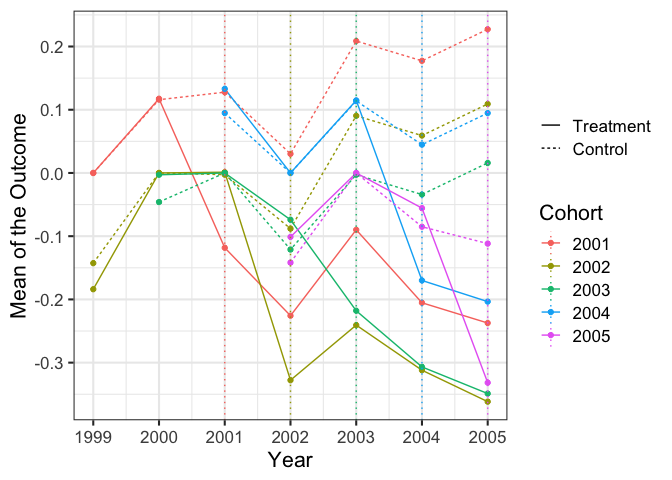
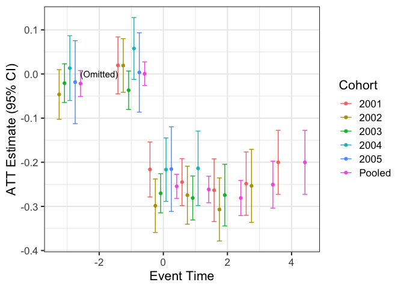
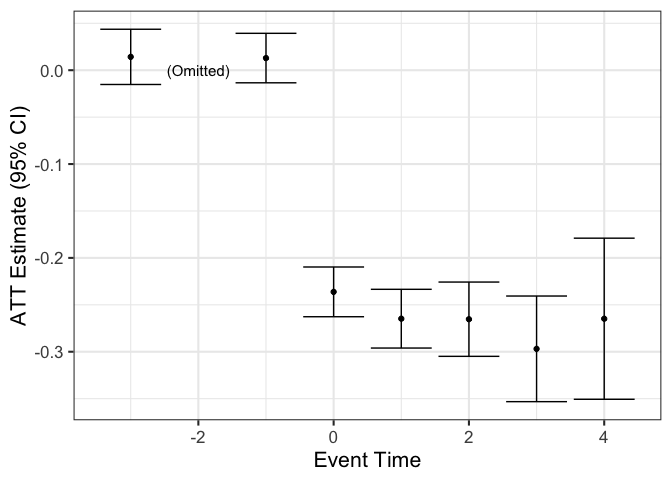

eventStudy: Perform an Event Study in R
================

Created by David Novgorodsky and Bradley Setzler, University of Chicago

The methods are explained in [our companion Practical Guide to Event Studies](https://github.com/setzler/eventStudy/blob/master/guide/event_study_guide.pdf).

**Disclaimer:** By using this software, you accept the terms of the MIT license. This is a work in progress. It is updated frequently. Please let us know if you find any bugs or have questions that are not addressed in the documentation.

Overview
========

### Purpose

`eventStudy` is an R package for performing event studies. It has many capabilites:

-   It maximizes sample size by using a "stacked" approach to match all possible control observations to any given treatment observation at any event time;
-   It allows the estimated treatment effects to vary over time and by treatment cohort. It can also impose a common treatment effect across cohorts (extending results by Abraham & Sun, 2018);
-   It has built-in tools to correct for anticipation (extending results by Fadlon & Nielsen, 2019) and deviations from parallel trends (either using covariate balancing in the spirit of Abadie, 2003, or modeling parametric deviations from parallel trends).

### Installation

**Preferred method:** The latest version of the package can be installed with the command `devtools::install_github("setzler/eventStudy/eventStudy")`.

Installation without internet access: Clone this repo to your personal machine, use the command line approach of `R CMD BUILD eventStudy/` to build the file eventStudy\_0.1.0.tar.gz, move this .tar.gz file to the location without internet access, then install on that location using the command `install.package("eventStudy_0.1.0.tar.gz",repo=NULL)` within an R session. In case you cannot clone and build the repo, we provide a (possibly out of date) version of the .tar.gz file above.

The `ES` command
================

The event study is performed by the `ES` command. The examples below show how to use it.

### Required Arguments of the `ES` command:

These required arguments simply supply `ES` your data and tell `ES` the names of your variables:

-   `long_data`: This is the data in long format (e.g., each row corresponds to a household in a given calendar year). It must be a data.table.
-   `outcomevar`: This is the outcome of interest. It must be a `character`.
-   `unit_var`: This is the individual. It must be a `character`.
-   `cal_time_var`: This is the calendar time variable (e.g., year). It must be a `character`.
-   `onset_time_var`: This is the time at which the observation is treated. It must be a `character`.
-   `cluster_vars`: These are the variables used to cluster standard errors (e.g., setting it to the same variable as `unit_var` is a common choice). It must be a `character vector`.

### Optional Arguments of the `ES` command:

These optional arguments allow you to customize `ES` to deal with issues like anticipation and non-parallel trends:

-   `omitted_event_time`: This lets you decide the pre-treatment event time to use as the reference year. It must be an integer that is less than or equal to `-1`. The default is `-2`.
-   `min_control_gap` and `max_control_gap`: `min_control_gap` is the minimum number of time periods ahead that a cohort must receive treatment in order to be included in the control group (e.g., Fadlon & Nielsen, 2018, use `min_control_gap=5`). It must be an integer that is at least `1`. The default is `1`. `max_control_gap` is similar but for the maximum number of time periods ahead (e.g., Fadlon & Nielsen, 2018, also use `max_control_gap=5`). It must be an integer that is at least as large as `min_control_gap`. The default is `Inf`.
-   `control_subset_var` and `control_subset_event_time`: These variables allow one to require that the control group satisfies a logical condition at a given event time. `control_subset_var` must be the name of a logical variable in the data (all values of this variable are `TRUE` or `FALSE`) and `control_subset_event_time` is an integer which specifies the event time at which the control group must have a value of `TRUE` on `control_subset_var`. The default is `control_subset_var=NA`, which bypasses this option.
-   `fill_zeros`: `fill_zeros` is a logical indicator (`TRUE` or `FALSE`) which results in the data being filled and the outcome set to zero for all observations on a unit that are missing within the time frame included in the data.
-   `linearize_pretrends`: `linearize_pretrends` is a logical indicator that, when set to `TRUE`, results in linear pre-trends being fit separately for the treatment and control group during the pre-event years, and then residualized out of both the pre-event and post-event outcomes.
-   `residualize_covariates`: Like `linearize_pretrends`, but it residualizes on provided covariates rather than time. Either `discrete_covars` (discrete covariates) or `cont_covars` (continuous covariates) or both must be specified as `character vectors` of variable names. Discrete covariates will be residualized using fixed effects, while continuous covariates will be residualized linearly.

### Plotting the results from `ES`

You can make your own plots with the results. As a convenience, we have prepared these functions to automatically make your plots:

-   `ES_plot_levels` will plot the levels across event times for the treated and control cohorts.
-   `ES_plot_ATTs` will plot the treatment effects across event times. By default, it will plot heterogeneous effects for each cohort; set `homogeneous_only = TRUE` to only plot the pooled effect under the homogeneity assumption.

Examples
========

### Set-up

``` r
devtools::install_github("setzler/eventStudy/eventStudy")
```

``` r
library(eventStudy)
library(ggplot2)
```

Let's simulate some data using our built-in convenience function called `ES_simulate_data`:

``` r
# simulate the data with 1000 individuals (use only the first element)
sim_data <- ES_simulate_data(units = 1000)[["observed"]]
# view the simulated data
sim_data[]
```

    ##       individual year treatment_year   outcome
    ##    1:          1 1999           2004 0.6637572
    ##    2:          1 2000           2004 0.2950501
    ##    3:          1 2001           2004 0.9890768
    ##    4:          1 2002           2004 0.2334075
    ##    5:          1 2003           2004 0.6467621
    ##   ---                                         
    ## 6996:       1000 2001           2004 0.5687820
    ## 6997:       1000 2002           2004 0.7370530
    ## 6998:       1000 2003           2004 0.8072028
    ## 6999:       1000 2004           2004 0.5591011
    ## 7000:       1000 2005           2004 0.2568518

In this data, the treatment is received in the year given by the `treatment_year` variable. The other variables are `individual`, `year`, and `outcome`. We wish to perform an event study to understand the effect of this treatment on this outcome.

To get a sense of what is in the simulated data, here is a plot of the mean outcomes by year at which treatment is received:

``` r
# calculate the means
cohort_means <- sim_data[,list(outcome = mean(outcome)), list(treatment_year,year)]
# plot the means
ggplot(data=cohort_means,aes(x=year,y=outcome,colour=factor(treatment_year))) + geom_line() + 
  labs(x = "Year", y = "Outcome", color = "Treatment") + theme_bw(base_size=16)
```


(Note: even though the data is drawn from the model with perfect control groups, the control groups do not look great visually!)

### Example 1. Basic Estimation

Given this data, we perform the basic event study as follows:

``` r
# run the event study
results <- ES(long_data=sim_data, outcomevar="outcome", 
              unit_var="individual", cal_time_var="year", 
              onset_time_var="treatment_year", cluster_vars="individual")
```

    ## Warning in as.POSIXlt.POSIXct(x, tz): unknown timezone 'zone/tz/2018i.1.0/
    ## zoneinfo/America/Chicago'

    ## INFO [2019-01-24 17:30:37] Beginning ES.
    ## INFO [2019-01-24 17:30:37] Beginning data stacking.
    ## INFO [2019-01-24 17:30:47] Successfully produced a stacked dataset.
    ## INFO [2019-01-24 17:30:48] Estimated heterogeneous case with OLS.
    ## INFO [2019-01-24 17:30:48] Estimated homogeneous case with OLS.
    ## INFO [2019-01-24 17:30:48] ES is finished.

### Example 2. Estimation using only control cohorts that receive treatment at certain times in the future

Let's only pair a control observation to a treatment observation if the control observation is treated at least 3 years later (`min_control_gap = 3`) and at most 5 years later (`max_control_gap = 5`):

``` r
# run the event study
results2 <- ES(long_data=sim_data, outcomevar="outcome", 
               unit_var="individual", cal_time_var="year", 
               onset_time_var="treatment_year", cluster_vars="individual", 
               min_control_gap = 3, max_control_gap = 5)
```

    ## INFO [2019-01-24 17:30:48] Beginning ES.
    ## INFO [2019-01-24 17:30:48] Beginning data stacking.
    ## INFO [2019-01-24 17:30:53] Successfully produced a stacked dataset.
    ## INFO [2019-01-24 17:30:54] Estimated heterogeneous case with OLS.
    ## INFO [2019-01-24 17:30:54] Estimated homogeneous case with OLS.
    ## INFO [2019-01-24 17:30:54] ES is finished.

### Example 3. Estimation using only control cohorts that satisfy a condition at an event time

Let's randomly assign some control groups to be valid in some years:

``` r
# adding the valid_control variable
sim_data[, valid_control := runif(nrow(sim_data)) < .5]
```

Now, with the `control_subset_var` and `control_subset_event_time` arguments, we can only use the control groups that satisfy `valid_control == TRUE` in the year before the treatment group receives treatment:

``` r
# run the event study
results3 <- ES(long_data=sim_data, outcomevar="outcome", 
               unit_var="individual", cal_time_var="year", 
               onset_time_var="treatment_year", cluster_vars="individual", 
               control_subset_var="valid_control", control_subset_event_time=-1)
```

    ## INFO [2019-01-24 17:30:54] Beginning ES.
    ## INFO [2019-01-24 17:30:54] Beginning data stacking.
    ## INFO [2019-01-24 17:31:04] Successfully produced a stacked dataset.
    ## INFO [2019-01-24 17:31:05] Estimated heterogeneous case with OLS.
    ## INFO [2019-01-24 17:31:05] Estimated homogeneous case with OLS.
    ## INFO [2019-01-24 17:31:05] ES is finished.

### Example 4. Removing linear deviations from parallel trends

Suppose we think that pre-trends differ from parallel in a linear way. Using `linearize_pretrends = TRUE` will estimate these linear trends on pre-event years and extrapolate the trends to post-event years:

``` r
# run the event study
results4 <- ES(long_data=sim_data, outcomevar="outcome", 
               unit_var="individual", cal_time_var="year", 
               onset_time_var="treatment_year", cluster_vars="individual", 
               linearize_pretrends = TRUE)
```

    ## INFO [2019-01-24 17:31:05] Beginning ES.
    ## INFO [2019-01-24 17:31:05] Linearizing pre-trends.
    ## INFO [2019-01-24 17:31:05] Beginning data stacking.
    ## INFO [2019-01-24 17:31:16] Successfully produced a stacked dataset.
    ## INFO [2019-01-24 17:31:17] Estimated heterogeneous case with OLS.
    ## INFO [2019-01-24 17:31:17] Estimated homogeneous case with OLS.
    ## INFO [2019-01-24 17:31:17] ES is finished.

### Example 5. Residualzing on covariates where some are discrete and some are continuous

Let's add some discrete and continuous covariates to the data:

``` r
# adding some covariates
sim_data[, cont_covar1 := runif(nrow(sim_data))]
sim_data[, cont_covar2 := runif(nrow(sim_data))]
sim_data[, discrete_covar1 := as.integer(runif(nrow(sim_data)) < .5)] # 2 levels
sim_data[, discrete_covar2 := as.integer(runif(nrow(sim_data)) < .5) + as.integer(runif(nrow(sim_data)) < .5)] # 3 levels
```

By default, each level of a discrete covariate is given its own fixed effect (except an omitted level), while continuous covariates are assumed to enter linearly. Be careful not to include too many levels in the discrete covariates since R can become very slow when estimating a large number of fixed effects. The coefficients are estimated on pre-treatment years and then extrapolated to the post-treatment years, allowing for the covariates to change in the meantime.

The argument `residualize_covariates = TRUE` will tell `ES` to residualize on covariates. The discrete covariates are passed to `ES` with the argument `discrete_covars`, while the continuous covariates are passed with the argument `cont_covars`:

``` r
# run the event study
results5 <- ES(long_data=sim_data, outcomevar="outcome",
               unit_var="individual", cal_time_var="year",
               onset_time_var="treatment_year", cluster_vars="individual",
               residualize_covariates = TRUE,
               discrete_covars = c('discrete_covar1','discrete_covar2'),
               cont_covars = c('cont_covar1','cont_covar2'))
```

    ## INFO [2019-01-24 17:31:17] Beginning ES.
    ## INFO [2019-01-24 17:31:17] Residualizing on covariates.
    ## INFO [2019-01-24 17:31:18] Beginning data stacking.
    ## INFO [2019-01-24 17:31:28] Successfully produced a stacked dataset.
    ## INFO [2019-01-24 17:31:29] Estimated heterogeneous case with OLS.
    ## INFO [2019-01-24 17:31:29] Estimated homogeneous case with OLS.
    ## INFO [2019-01-24 17:31:29] ES is finished.

### Example 6. Filling in missing rows with zeros.

Let's randomly drop some of the rows from the data so that it is no longer balanced:

``` r
sim_data <- sim_data[runif(nrow(sim_data)) < .8]
```

Suppose that missing rows have a true value of zero for the outcome. We can add the missing rows and fill in zeros for the outcome using the `fill_zeros = TRUE` argument:

``` r
# run the event study
results6 <- ES(long_data=sim_data, outcomevar="outcome", 
               unit_var="individual", cal_time_var="year", 
               onset_time_var="treatment_year", cluster_vars="individual",
               fill_zeros = TRUE)
```

    ## INFO [2019-01-24 17:31:29] Beginning ES.
    ## INFO [2019-01-24 17:31:29] Filling in zeros.
    ## INFO [2019-01-24 17:31:29] Beginning data stacking.
    ## INFO [2019-01-24 17:31:40] Successfully produced a stacked dataset.
    ## INFO [2019-01-24 17:31:40] Estimated heterogeneous case with OLS.
    ## INFO [2019-01-24 17:31:41] Estimated homogeneous case with OLS.
    ## INFO [2019-01-24 17:31:41] ES is finished.

### Bonus Example. Plotting the results from `ES`

Now, we plot the results. First, we plot the treatment and control means. `ES` has constructed the appropriate control group for each treatment group. We can see that it looks much cleaner than in the raw data:

``` r
ES_plot_levels(results, lower_event = -3, upper_event = 5) + ylab("Mean of the Outcome")
```



Note that, becuase `omitted_event_time=-2`, the treatment and control group means must both be zero at event time -2, for each treatment-control pair.

Next, we plot the treatment effects, comparing the cohort-specific effects to the pooled effect that comes from imposing homogeneity across cohorts:

``` r
ES_plot_ATTs(results, lower_event = -3, upper_event = 5) + ylab("ATT Estimate (95% CI)")
```



Finally, if we only care about the estimates under the homogeneity assumption, we can show these as follows:

``` r
ES_plot_ATTs(results, lower_event = -3, upper_event = 5, homogeneous_only = TRUE) + 
  ylab("ATT Estimate (95% CI)")
```


