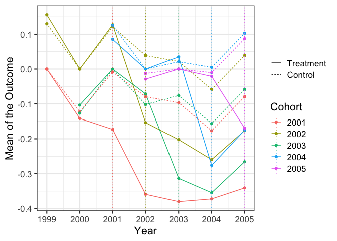
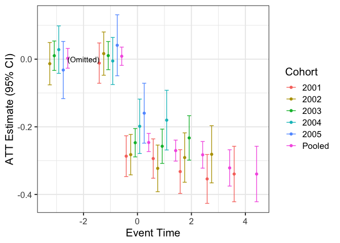

eventStudy: Perform an Event Study in R
================

Created by David Novgorodsky and Bradley Setzler, University of Chicago

By using this software, you accept the terms of the MIT license.

Note: This is a work in progress. It is updated frequently. Please let us know if you find any bugs or have questions that are not addressed in the documentation.

Overview
--------

`eventStudy` is an R package for performing event studies. It has many capabilites:

-   It maximizes sample size by using a "stacked" approach to match all possible control observations to any given treatment observation at any event time;
-   It allows the estimated treatment effects to vary over time and by treatment cohort. It can also impose a common treatment effect across cohorts (extending results by Abraham and Sun, 2018);
-   It has built-in tools to correct for anticipation (extending results by Fadlon & Nielsen, 2018) and deviations from parallel trends (either using covariate balancing in the spirit of Abadie, 2003, or modeling parametric deviations from parallel trends).

We wrote a practical guide to event studies that explains all of the identification and estimation issues [available here](https://github.com/setzler/eventStudy/blob/master/guide/event_study_guide.pdf).

The latest version of the package can be installed with the command `devtools::install_github("setzler/eventStudy")`.

The `ES` command
----------------

The event study is performed by the `ES` command.

### Required Arguments of the `ES` command:

These commands simply supply `ES` your data and tell `ES` the names of your variables:

-   `long_data`: This is the data in long format (e.g., each row corresponds to a household in a given calendar year). It must be a data.table.
-   `outcomevar`: This is the outcome of interest. It must be a `character`.
-   `unit_var`: This is the individual. It must be a `character`.
-   `cal_time_var`: This is the calendar time variable (e.g., year). It must be a `character`.
-   `onset_time_var`: This is the time at which the observation is treated. It must be a `character`.
-   `cluster_vars`: These are the variables used to cluster standard errors (e.g., setting it to the same variable as `unit_var` is a common choice).

### Optional Arguments of the `ES` command:

These commands allow you to customize the event study to deal with issues like anticipation and non-parallel trends:

-   `omitted_event_time`: This lets you decide the pre-treatment event time to use as the reference year. It must be an integer that is less than or equal to `-1`. The default is `-2`.
-   `min_control_gap`: This is the minimum number of time periods ahead that a cohort must receive treatment in order to be included in the control group (e.g., Fadlon & Nielsen, 2018, use `min_control_gap=5`). It must be an integer that is at least `1`. The default is `1`.
-   `max_control_gap`: Like `min_control_gap`, but for the maximum number of time periods ahead (e.g., Fadlon & Nielsen, 2018, use `max_control_gap=5`). It must be an integer that is at least as large as `min_control_gap`. The default is `Inf`.
-   `control_subset_var` and `control_subset_event_time`: These variables allow one to require that the control group satisfies a logical condition at a given event time. `control_subset_var` must be the name of a logical variable in the data (all values of this variable are `TRUE` or `FALSE`) and `control_subset_event_time` is an integer which specifies the event time at which the control group must have a value of `TRUE` on `control_subset_var`. The default is `control_subset_var=NA`, which bypasses this option.
-   `fill_zeros` and `vars_to_fill`: `fill_zeros` is a logical indicator (`TRUE` or `FALSE`) which results in the data being filled for all observations that are missing. If an individual (`unit_var`) does not have a row of data for some calendar time (`cal_time_var`), such a row will be created when `fill_zeros=TRUE`. The outcome variable will have a missing value `NA` for any created rows. `vars_to_fill` is a `character` vector of variable names for which `NA` should be replaced by `0`. This is useful if missing data indicates that the true value of the outcome is zero (in this case, set `fill_zeros=TRUE` and `vars_to_fill` should include the `outcomevar`).

Plotting the results
--------------------

You can make your own plots with the results. As a convenience, we have prepared these functions to automatically make your plots:

-   `ES_plot_levels` will plot the levels across event times for the treated and control cohorts.
-   `ES_plot_ATTs` will plot the treatment effects across event times. By default, it will plot heterogeneous effects for each cohort; set `homogeneous_only = TRUE` to only plot the pooled effect under the homogeneity assumption.

Examples
========

Getting started
---------------

``` r
devtools::install_github("setzler/eventStudy")
```

``` r
library(eventStudy)
library(ggplot2)
```

Example 1: Perfect Control Groups
---------------------------------

First, we simulate some data using our function called `ES_simulate_data`:

``` r
# simulate the data with 1000 individuals (use only the first element)
sim_data <- ES_simulate_data(units = 1000)[["observed"]]
# view the simulated data
sim_data[]
```

    ##       individual year treatment_year    outcome
    ##    1:          1 1999           2002 0.30258885
    ##    2:          1 2000           2002 0.67674199
    ##    3:          1 2001           2002 1.08722711
    ##    4:          1 2002           2002 0.60191240
    ##    5:          1 2003           2002 0.02669948
    ##   ---                                          
    ## 6996:       1000 2001           2003 1.23179525
    ## 6997:       1000 2002           2003 0.66567866
    ## 6998:       1000 2003           2003 0.55033053
    ## 6999:       1000 2004           2003 0.44312152
    ## 7000:       1000 2005           2003 0.15379552

In this data, the treatment is received in the year given by the `treatment_year` variable. The other variables are `individual`, `year`, and `outcome`. We wish to perform an event study to understand the effect of this treatment on this outcome.

Here is a plot of the mean outcomes by year at which treatment is received:

``` r
# calculate the means
cohort_means <- sim_data[,list(outcome = mean(outcome)), list(treatment_year,year)]
# plot the means
ggplot(data=cohort_means,aes(x=year,y=outcome,colour=factor(treatment_year))) + geom_line() + labs(x = "Year", y = "Outcome", color = "Treatment") + theme_bw(base_size=16)
```


(Note: even though the data is drawn from the model with perfect control groups, the control groups do not look great visually!)

Given this data, we perform the event study as follows:

``` r
# run the event study
results <- ES(long_data=sim_data, outcomevar="outcome", unit_var="individual", cal_time_var="year", onset_time_var="treatment_year", cluster_vars="individual")
```

    ## Warning in as.POSIXlt.POSIXct(x, tz): unknown timezone 'zone/tz/2018i.1.0/
    ## zoneinfo/America/Chicago'

    ## INFO [2019-01-23 23:29:45] Successfully produced a stacked dataset.
    ## INFO [2019-01-23 23:29:46] Estimated heterogeneous case with OLS.
    ## INFO [2019-01-23 23:29:47] Estimated homogeneous case with OLS.

Now, we plot the results. First, we plot the treatment and control means. The ES function has constructed the appropriate control group for each treatment group. We can see that it looks much cleaner than in the raw data:

``` r
ES_plot_levels(results, lower_event = -3, upper_event = 5) + ylab("Mean of the Outcome")
```



Finally, we plot the treatment effects, comparing the cohort-specific effects to the pooled effect that comes from imposing homogeneity across cohorts:

``` r
ES_plot_ATTs(results, lower_event = -3, upper_event = 5) + ylab("ATT Estimate (95% CI)")
```


